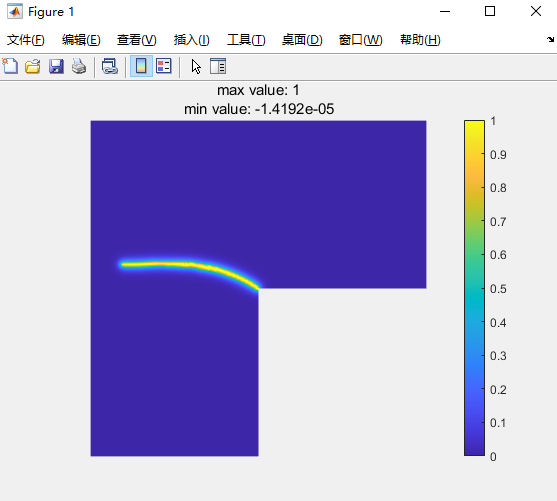
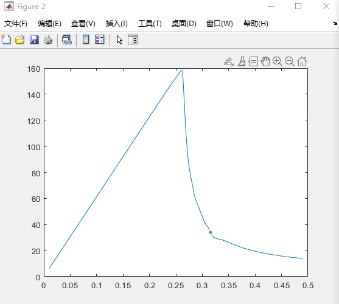

## MatPFF
MatPFF: Matlab FEM program for phase-field fracture (AT1/2, PFCZM) simulation

## Features

- Two-dimensional linear elastic phase-field fracture 
- AT1 & AT2  phase-field models, PFCZM is added in 24-12-12

## Example

- LPlate，AT1

> Figure 1. Snapshot of the phase-field.
>
> 
>
> Figure 2. The displacement-force curve.
>
> 

- LPlate，PFCZM，A unified phase-field theory for the mechanics of damage and quasi-brittle failure

> Figure 3. Model configuration.
>
> 
>
> 
>
> Figure 4. The displacement-force curve.
>
> 

## Final
Please cite our papers If you use the codes: 
- P.M. Hu, C.Y. Dong, H. Zhen, C. Xu, C.Z. Zhang, Higher-order phase field fracture simulation in nearly incompressible viscoelasticity, Eng. Fract. Mech. 293 (2023) 109655.
- P.M. Hu, H. Zhen, H.S. Yang, C. Xu, C.Y. Dong, Rate-dependent phase field fracture simulation in polymers with adaptive mixed isogeometric approach, Comput. Methods Appl. Mech. Engrg. 422 (2024) 116843.

